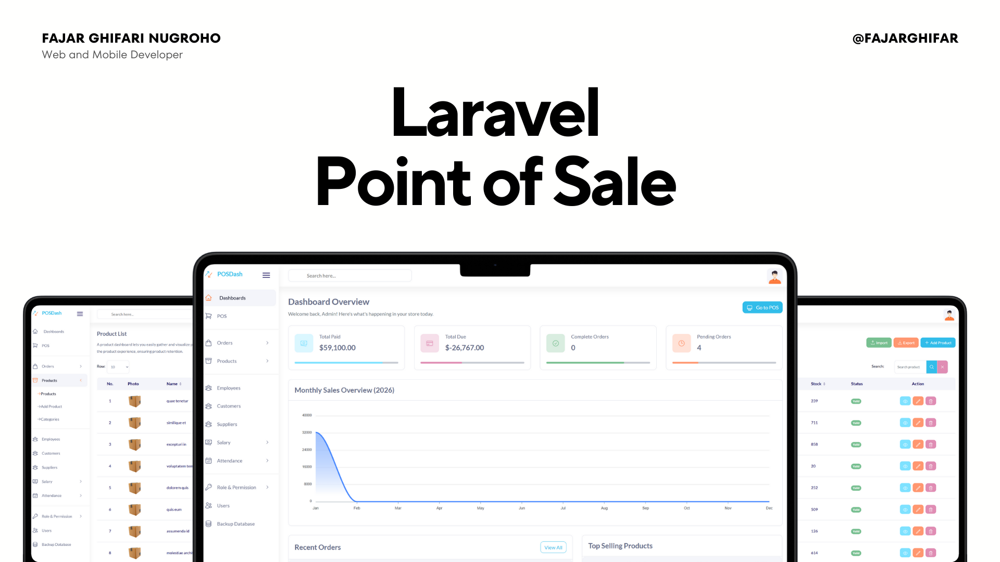

# Laravel Point of Sale System 🚀


A robust, enterprise-grade **Point of Sale (POS)** management system built with **Laravel 10** and **MySQL**. Designed for efficiency, this application features a **Bootstrap-based** responsive interface with **Vanilla JS** driven POS logic for maximum compatibility and performance.



---

## ✨ Key Features

### 🛒 Point of Sale (POS) Interface
*   **Efficient Transaction Processing:** Fast and user-friendly interface for managing sales and carts.
*   **Smart Search:** Quickly find products by name or code.
*   **Dynamic Cart:** Real-time subtotal and tax calculations using `hardevine/shoppingcart`.

### 📦 Inventory & Product Management
*   **Stock Tracking:** Automated stock deduction upon sale completion.
*   **Barcode Support:** Integrated `picqer/php-barcode-generator` for product operational efficiency.
*   **Category Management:** Organize products into hierarchical categories for easier access.

### 👥 HR & User Management
*   **Employee Management:** Track employee details, salaries, and attendance.
*   **Payroll System:** Manage advance salaries and monthly payroll with history tracking.
*   **Role-Based Access Control (RBAC):** Granular permission management powered by `spatie/laravel-permission` to secure sensitive modules.

### 💰 Financial & Reporting
*   **Order Management:** Track Pending, Completed, and Due status orders.
*   **Interactive Dashboard:** Visual analytics using **ApexCharts** for sales trends and top-selling products.
*   **Invoice Generation:** Professional invoice printing for every transaction.

---

## 🛠️ Tech Stack

*   **Backend:** [Laravel 10](https://laravel.com/) (PHP 8.1+)
*   **Frontend:** Blade Templates, **Bootstrap 4/5** (Layout), **Tailwind CSS** (Utilities), Vanilla JS
*   **Database:** MySQL / MariaDB
*   **Icons:** [Heroicons](https://heroicons.com/) (blade-ui-kit)
*   **Core Libraries:**
    *   `spatie/laravel-permission`: Authorization
    *   `hardevine/shoppingcart`: Cart Logic
    *   `haruncpi/laravel-id-generator`: SKU Generation
    *   `spatie/laravel-backup`: DB Backups

---

## 🚀 Installation Guide

Follow these steps to set up the project locally:

### 1. Clone the Repository
```bash
git clone https://github.com/fajarghifar/laravel-point-of-sale
cd laravel-point-of-sale
```

### 2. Install Dependencies

```bash
composer install
npm install && npm run build
```

### 3. Environment Setup

Copy the example environment file and configure your database credentials:

```bash
cp .env.example .env
# Open .env and set DB_DATABASE, DB_USERNAME, DB_PASSWORD
```

Generate the application key:

```bash
php artisan key:generate
```

### 4. Database Setup & Seeding

Run the migrations and seeders to populate the database with realistic test data (Indonesian/English locale supported):

```bash
php artisan migrate:fresh --seed
```

### 5. Create Storage Link

Link the storage directory to public for image serving:

```bash
php artisan storage:link
```

### 6. Start the Server

```bash
php artisan serve
```

Access the app at `http://localhost:8000`.

---

## 🔑 Default Credentials

Use the following credentials to access the Admin Dashboard:

| Role | Username | Password |
| --- | --- | --- |
| **Admin** | `admin` | `password` |

> **Note:** For security reasons, please change these credentials or create new users immediately after deployment.

---

## 🚀 Configuration

### Cart Settings
Open `./config/cart.php` to configure tax rates, number formats, and other cart-specific settings via the `hardevine/shoppingcart` package.

### Localization
To set the Faker locale (e.g., for Seeder data), add this to your `.env`:
```bash
FAKER_LOCALE="id_ID" # or en_US
```

---

## 🤝 Contributing

Contributions are welcome! Please follow these steps:

1.  Fork the project.
2.  Create your feature branch (`git checkout -b feature/AmazingFeature`).
3.  Commit your changes (`git commit -m 'Add some AmazingFeature'`).
4.  Push to the branch (`git push origin feature/AmazingFeature`).
5.  Open a Pull Request.

---

## 📄 License

This project is open-sourced software licensed under the [MIT license](https://opensource.org/licenses/MIT).

---

**Made with ❤️ by Fajar Ghifari Nugroho**
